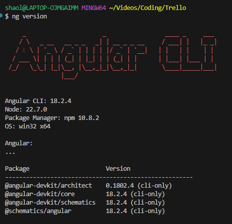

# DefinitelyNotTrello

# Section 1: Preparing tools

# Angular Initialization and Set-Up

# Angular: Initialization Process

## Downloading Packages

```python
npm install -g @angular/cli
```

- installs angular cli globally

```python
ng --version
```

- shows version of currently installed Angular

```python
ng version
```

- shows Angular CLI version, Node.js version, package manager, OS, and other Angular-related packages.



## Initializing Project

```python
mkdir eltrello
cd eltrello
```

- make files pertaining to the file management

### Separate Backend (server) from Frontend (client)

```bash
mkdir client #will have angular app
mkdir server #will have node and express
```

- Makes it easier to parse what is front end and backend
- allows us to assign files to different teams
- if we have different folders, its not a monolith which means we wont inject things from backend into frontend folder and vice versa.

### Initialize Angular App

```bash
ng new client
cd client
ng serve
```

- because `client` already exists, we use ng new
- instead, IF THE FOLDER exists, we use:

```bash
ng new eltrello --directory ./
```

### Option Selection:

1. `would you like to add Angular routing?` - Yes
2. `which stylesheet format would you like to use?` - SCSS
3. ``Do you want to enable Server-Side Rendering (SSR) and Static Site Generation (SSG/Prerendering)? ` - No

### Rendering the page

- To render the page, we use `ng serve` and click on localhost.
- the `app.component` is what renders our page.
    - location is:  `client\src\app`
    
    ```bash
    C:\Users\shaol\Videos\Coding\Trello\eltrello\client\src\app\app.component.html
    ```
    


# Angular: Project Set-Up

1. delete `app.component.scss`
2. delete contents of `app.compontent.html` in
    
    ```bash
    C:\Users\shaol\Videos\Coding\Trello\eltrello\client\src\app\app.component.html
    ```
    
        up until: 
    
    ```bash
    <router-outlet />
    ```
    
3. open `app.component.ts` and delete the `StyleUrl` and `title`
    
    ```tsx
    import { Component } from '@angular/core';
    import { RouterOutlet } from '@angular/router';
    
    @Component({
      selector: 'app-root',
      standalone: true,
      imports: [RouterOutlet],
      templateUrl: './app.component.html',
      // styleUrl: './app.component.scss'
    })
    export class AppComponent {
      // title = 'eltrello';
    }
    ```
    
4. [`localhost:4200`](http://localhost:4200) should now render:
    
    
    

# Configuring NodeJS Server

## Initializing Node

```tsx
npm init
```

- it will create a package JSON file under the `server` folder.
    
    
    
- `npm init` will prompt questions, hit enter for everything.
    - Will generate (if a github repo is specified):
    
    ```tsx
    {
      "name": "server",
      "version": "1.0.0",
      "main": "index.js",
      "scripts": {
        "test": "echo \"Error: no test specified\" && exit 1"
      },
      "repository": {
        "type": "git",
        "url": "git+https://github.com/yinshaolong/Trello.git"
      },
      "author": "",
      "license": "ISC",
      "bugs": {
        "url": "https://github.com/yinshaolong/Trello/issues"
      },
      "homepage": "https://github.com/yinshaolong/Trello#readme",
      "description": ""
    }
    
    ```
    

## Downloading Packages

### Installing Nodemon

```tsx
npm install nodemon -D
```

- a package that will reload the page every time there is a change.
- Angular will typically do this in the client, but our backend project does not have a web server doing this for us.
- `-D` will install nodemon as a devDependency
    - `devDependency` - a dependency that is only installed whilst developing a project.
        - i.e. not need for production.

### Installing TypeScript Node

```tsx
npm install ts-node -D
```

- Installs the process which will transform our typescript code to JavaScript on the fly
- it will install `ts-node` as a devDependency

## MongoDB initialization

### Installing MongoDB

- Download from: https://www.mongodb.com/try/download/community
    
    ```tsx
    mongod #runs mongoDB process on the machine
    mongo #jump directly instead the console
    ```
    
    - or
- Down from:  https://hub.docker.com/_/mongo
    - allows us to use it without needing to create additional files or caring about permissions/folders.
- run the following command after:
    
    ```tsx
    docker run -d -p 27017-27019:27017-27019 --name mongodb mongo:latest
    ```
    
    - outputs a hash because docker downloads mongodb on our machine
- Explanation:
    - `-d` - detached, meaning to download not in the terminal but elsewhere.
    - `-p` - ports, specifying the port number where we will be downloading from
    - `-name` - the name of the process we will be downloading
        - `mongodb` - the name of the container on the machine
        - `mongo:4.0.4` - the version of mongodb we will be downloading
- In docker, if mongodb is green, that means that mongodb is currently running and we can speak to it.


## MongoDB Execution in Docker ** Start

```tsx
docker exec -it mongodb mongosh
```

- Explanation:
    - `exec` - for execute the following command
    - [**`-it`** allows you to run the **`mongo`** shell interactively within the **`mongodb`** container, enabling you to execute commands directly and see the output in real-time1](https://sparkbyexamples.com/mongodb/run-mongodb-in-docker-container/).
    - `mongodb` - the name of our container
    - `mongosh` - mongo secure shell, allowing us to write directly to the database

```tsx
show dbs;
```

- 

## Setup Configuration

## 1. package.json Configuration

- in `package.json` under `"scripts"` add “start”:
    
    ```tsx
      "scripts": {
        "start" : "nodemon src/server.ts"
      },
    ```
    
- nodemon will automatically run `ts-node` on the server.ts file to convert to javascript and run it in our webserver.

## 2. tsconfig.json

```tsx
code tsconfig.json
```

- instructions on how typescript while transform code to Javascript
- creates a config file for typescript in `server`

```tsx
{
    "compilerOptions": {
        "module": "commonjs",
        "target": "es6",
        "moduleResolution": "node",
        "sourceMap": true,
        "outDir": "dist",
        "esModuleInterop": true,
        "strict": true,
    }
}
```

- paste the following into the config file.

Explanation:

- **`module`**: Defines the module system (CommonJS for Node.js).
- **`target`**: Specifies the JavaScript version (ES6 for modern features).
- **`moduleResolution`**: Ensures modules are resolved like in Node.js.
- **`sourceMap`**: Generates source maps for easier debugging.
- **`outDir`**: Specifies the output directory for compiled files.
- **`esModuleInterop`**: Enables compatibility between CommonJS and ES6 modules.
- **`strict`**: Enforces strict type-checking for better code quality.
- Further explained:
    
    ### **`compilerOptions`**
    
    This section specifies various settings for the TypeScript compiler.
    
    1. **`module`: “commonjs”**
        - **Explanation**: This setting specifies the module system to use. **`commonjs`** is the module system used by Node.js.
        - **Why It’s Important**: It allows you to use **`require`** and **`module.exports`** for importing and exporting modules, which is standard in Node.js environments.
    2. **`target`: “es6”**
        - **Explanation**[: This setting specifies the version of JavaScript to which TypeScript code will be compiled**`es6`** (also known as ECMAScript 2015) includes modern JavaScript features like **`let`**, **`const`**, arrow functions, classes, and more1](https://www.w3schools.com/Js/js_es6.asp).
        - **Why Target ES6**: Targeting ES6 is a good idea because it provides modern features that make the code more readable and maintainable. [Most modern browsers and environments support ES6, making it a safe choice](https://www.w3schools.com/Js/js_es6.asp)[2](https://www.typescriptlang.org/tsconfig/target.html).
    3. **`moduleResolution`: “node”`**
        - **Explanation**: This setting determines how modules are resolved. **`node`** module resolution mimics the Node.js module resolution mechanism.
        - **Why It’s Important**: It ensures that the TypeScript compiler can find and load modules in the same way Node.js does, which is crucial for server-side development.
    4. **`sourceMap`: true**
        - **Explanation**: This setting enables the generation of source map files. [Source maps map the compiled JavaScript code back to the original TypeScript code3](https://www.typescriptlang.org/tsconfig/sourceMap.html).
        - **Why It’s Important**: Source maps are essential for debugging. [They allow developers to see the original TypeScript code in the browser’s developer tools, making it easier to trace errors and understand the code flow4](https://web.dev/articles/source-maps).
    5. **`outDir`: “dist”`**
        - **Explanation**: This setting specifies the output directory for the compiled JavaScript files.
        - **Why It’s Important**: It helps organize the project by keeping the compiled files separate from the source files, typically in a **`dist`** (distribution) folder.
    6. **`esModuleInterop`: true**
        - **Explanation**: This setting enables interoperability between CommonJS and ES6 modules.
        - **Why It’s Important**: It allows you to import CommonJS modules using ES6 **`import`** syntax, making the code cleaner and more consistent.
    7. **`strict`: true**
        - **Explanation**: This setting enables all strict type-checking options.
        - **Why It’s Important**: It helps catch potential errors early by enforcing stricter type checks, leading to more robust and reliable code.
    - 

## src

- in `server`, make a `src` directory and a file called `server.ts` in it
    - in `server\package.json` we start from here:

```tsx
mkdir src
cd src
code server.ts
```

- in the file we can write:

```tsx
console.log("server is running")
```

- followed by in the terminal:

```tsx
npm start
```


- nodemon started our ts-node and then ran our code

# Section 2: Authentication

# Server folder Package Installation : Web Sockets

- install packages in `server` NOT the root (DefintielyNotTrello) folder.

```tsx
npm install express
npm install mongoose
npm install socket.io
```

- mongoose is the most popular package to work with mongodb
    - allows for a connection with mongodb, create and work with models

 

## Configuring Server

```tsx
code /server/src/server.ts
```

- we will be using `import` instead of `require` because we are translating code to javascript and using ecmascript6 /node compatible syntax. `/server/src/tsconfig.json`

```tsx
import express from "express";
```

- Typescript does not inherently know express, and so we will have to give it an alternative command:
    
    ```tsx
    npm install @types/express -D
    npm install @types/node -D
    ```
    

# server/src/server.ts configuration

- only connect to the web server AFTER we have confirmed the database is working.

```tsx
import express from "express";
import { createServer } from "http";
import { Server } from 'socket.io';
import mongoose from 'mongoose';

const app = express();
const httpServer = createServer(app);
const io = new Server(httpServer);

app.get('/', (req, res) => {
    res.send('Hello World!');
});

io.on('connection', () => {
    console.log("connected")
})

mongoose.connect('mongodb://localhost:27017/DefinitelyNotTrello').then(() => {
    console.log("Connected to MongoDB");
    // only connect to web server AFTER we are connected to mongoDB
    httpServer.listen(4001, () => {
        console.log('listening on *:4001');
    });
})

```

- ``app`` - instance of express
- `httpServer` - our express server
- `io` - io which makes web socket requests
- Explanation:
    1. **`const app = express();`**
        - This line creates an instance of an Express application. Express is a popular web framework for Node.js that simplifies the process of building web servers and APIs. Think of **`app`** as your main web server that will handle incoming requests and send responses.
    2. **`const httpServer = createServer(app);`**
        - Here, you’re creating an HTTP server using Node.js’s built-in **`http`** module. The **`createServer`** function takes your Express app (**`app`**) as an argument, meaning this HTTP server will use your Express app to handle requests. This server will listen for incoming HTTP requests and pass them to your Express app.
    3. **`const io = new Server(httpServer);`**
        - This line sets up a new instance of Socket.IO, a library that enables real-time, bidirectional communication between web clients and servers. By passing **`httpServer`** to **`new Server()`**, you’re telling Socket.IO to use this HTTP server for handling WebSocket connections. This allows you to add real-time features to your web application, like live chat or notifications.

```tsx
app.get('/', (req, res) => {
    res.send('Hello World!');
});

httpServer.listen(4001, () => {
    console.log('listening on *:4001');
});
```

- Explanation:
    1. **Imports**
        
        ```jsx
        import express from "express";
        import { createServer } from "http";
        import { Server } from 'socket.io';
        import mongoose from 'mongoose';
        
        ```
        
        - These lines import the necessary libraries:
            - `express`: A web framework for Node.js.
            - `createServer`: A function from Node.js’s `http` module to create an HTTP server.
            - `Server`: The Socket.IO server class for real-time communication.
            - `mongoose`: An ODM (Object Data Modeling) library for MongoDB and Node.js.
    2. **Express Application and HTTP Server**
        
        ```jsx
        const app = express();
        const httpServer = createServer(app);
        const io = new Server(httpServer);
        
        ```
        
        - `app = express();`: Creates an Express application.
        - `httpServer = createServer(app);`: Creates an HTTP server using the Express app.
        - `io = new Server(httpServer);`: Sets up a Socket.IO server to handle real-time communication.
    3. **Route Handling**
        
        ```jsx
        app.get('/', (req, res) => {
            res.send('Hello World!');
        });
        
        ```
        
        - This sets up a route for the root URL (`'/'`). When someone visits this URL, the server responds with “Hello World!”.
    4. **Socket.IO Connection Event**
        
        ```jsx
        io.on('connection', () => {
            console.log("connected");
        });
        
        ```
        
        - This listens for new connections to the Socket.IO server. When a client connects, it logs “connected” to the console.
    5. **MongoDB Connection and Server Start**
        
        ```jsx
        mongoose.connect('mongodb://localhost:27017/DefinitelyNotTrello').then(() => {
            console.log("Connected to MongoDB");
            // only connect to web server AFTER we are connected to mongoDB
            httpServer.listen(4001, () => {
                console.log('listening on *:4001');
            });
        });
        
        ```
        
        - `mongoose.connect('mongodb://localhost:27017/DefinitelyNotTrello')`: Connects to a MongoDB database named `DefinitelyNotTrello` running on `localhost`.
        - `.then(() => { ... })`: Once the connection to MongoDB is successful, it logs “Connected to MongoDB” and starts the HTTP server on port 4001, logging “listening on *:4001”.
    
    In summary, this code sets up a web server using Express, enables real-time communication with Socket.IO, connects to a MongoDB database, and only starts the server after successfully connecting to the database.
    

# Creating Mongoose User Model

## user.interface.ts

```tsx
mkdir server/src/types
cd types
code user.interface.ts
```

- `user` prefix to define what type of entity exists in the mongodb

```tsx
import { Document } from "mongoose";

export interface User {
  email: string;
  username: string;
  password: string;
  createdAt: Date;
}

export interface UserDocument extends User, Document {
  validatePassword(param1: string): Promise<boolean>;
}

```

- `export` - exports an `interface` (class) to be sent
- export interface using `Document` since it has an `id` that gets assigned to User.

## user.ts

```tsx
mkdir server/src/models
cd models
code user.ts
```

- creating a `user.ts` for the schema (blueprint) defining how data is organized within a database.

```bash
npm install validator @types/validator -D #validates that an email is valid
npm install bcryptjs @types/bcryptjs #for encryption
```

- adding `@types` so that typescript can understand the library.

```tsx
import { Schema, model } from 'mongoose';
import { UserDocument } from '../types/user.interface';
import validator from 'validator';
import bcryptjs from 'bcryptjs';

const userSchema = new Schema<UserDocument>({
    email: {
        type: String,
        required: [true, "Email is required"], // custom falsey message
        validate: [validator.isEmail, "Invalid email"], // validator is a library that checks 
        createIndexes: { unique: true }, // unique: true, // primary key
    },
    username: {
        type: String,
        required: [true, "Username is required"],
    },
    password: {
        type: String,
        required: [true, "Password is required"],
        select: false, // don't return password
    },
},
    {
        timestamps: true // createdAt, updatedAt
    }
);
userSchema.pre('save', async function (next) {
    if (!this.isModified('password')) { //check if password was changed
        return next();
    }
    try { //salt is a random string that is used to hash the password e.g. password + salt = hash
        const salt = await bcryptjs.genSalt(10); // 10 is the number of rounds to generate the salt
        this.password = await bcryptjs.hash(this.password, salt);
    } catch (err) {
        return next(err as Error); // cast to Error since type is unknown
    }
});
userSchema.methods.validatePassword = async function (password: string): Promise<boolean> {
    return await bcryptjs.compare(password, this.password);
};

export default model<UserDocument>('User', userSchema);

```

- `select: false` - can’t query for the passport

# Adding Registration in NodeJS

## Making MVC Architecture

- Currently `DefinitelyNotTrello/server/src/` has `models` and `types`
    - We want to build `MVC Architecture` → Model / Viewer / Controller
        - 90% of code will go into Model and Controller
        - we wont use Views because we’re creating an API that doesnt need to render views.
        - Views will be used just to respond with JSON.
    - Express doesn't have pre-built architecture
        - In Express we just define the route and start server.

### Controllers

- Making `Controllers` directory
    - create a usersController.ts file named users (Controller redundant because its in controllers directory)
    - When making Controllers, the prefix should always be plural, e.g. `users`
    
    ```tsx
    mkdir controllers
    code controllers/users.ts
    ```
    
    - Create files in accordance to routes
        - e.g. `usersController` where have code about `registration`
            - login controller for: user login and out
            - board controller where we write everything related to board.
    - All routes will be handled by specific controllers.
        
        ```tsx
        import * as usersController from './controllers/users';
        app.post('/api/users', usersController.register)
        ```
        
    
    ### User Creation and Storing in DB
    
    - in `server`
    
    ```tsx
    npm install body-parser
    ```
    
    - By default, Express can’t parse body, and so we need to import a module.
    
    ```tsx
    //controllers/users.ts
    import { Request, Response } from 'express';
    import { NextFunction } from 'express-serve-static-core';
    import UserModel from '../models/user'; //import User model to register
    
    export const register = async (
        req: Request,
        res: Response,
        next: NextFunction
    ) => {
        try {
            const newUser = new UserModel({ //userModel is a mongoose model
                email: req.body.email,
                username: req.body.username,
                password: req.body.password
            });
            console.log('newUser', newUser);
            const savedUser = await newUser.save() //mongoose save function
            console.log("savedUser", savedUser);
        } catch (err) {
            next(err); // will propogate the error to express which will show on screen
        }
    }
    ```
    
    - `Register`
        - will be interacting with the database, so will be async
        - will be similar to  callback function below:
        
        ```tsx
        app.get('/', (req, res) => {
            res.send('Hello World!');
        });
        ```
        
        ### Middleware in Express (bodyParser) **server.ts**
        
        ### **Middleware in Express**
        
        Middleware functions are functions that have access to the request object (`req`), the response object (`res`), and the next middleware function in the application’s request-response cycle. They can execute code, make changes to the request and response objects, end the request-response cycle, and call the next middleware function.
        
        ### **`body-parser` Middleware**
        
        `body-parser` is a middleware that parses incoming request bodies in a middleware before your handlers, available under the `req.body` property. It is commonly used to parse JSON and URL-encoded data.
        
        ### **Explanation of the Code**
        
        1. **Parsing JSON Data**
            
            app.use(bodyParser.json()); // returns middleware that only parses JSON
            
            This line adds middleware to your Express application that parses incoming requests with JSON payloads. When a request is received with a `Content-Type` of `application/json`, this middleware will parse the JSON data and make it available on `req.body`.
            
            - **Example**: If a client sends a POST request with a JSON body:After this middleware runs, you can access the data in your route handler like this:
                
                {
                
                "name": "John",
                
                "age": 30
                
                }
                
                app.post('/example', (req, res) => {
                
                console.log(req.body.name); // "John"
                
                console.log(req.body.age);  // 30
                
                res.send('Data received');
                
                });
                
        2. **Parsing URL-encoded Data**
            
            app.use(bodyParser.urlencoded({ extended: true })); //
            
            This line adds middleware to your Express application that parses incoming requests with URL-encoded payloads. URL-encoded data is typically used when submitting form data. The `extended: true` option allows for rich objects and arrays to be encoded into the URL-encoded format, using the `qs` library.
            
            - **Example**: If a client sends a POST request with URL-encoded form data:After this middleware runs, you can access the data in your route handler like this:
                
                name=John&age=30
                
                app.post('/example', (req, res) => {
                
                console.log(req.body.name); // "John"
                
                console.log(req.body.age);  // 30
                
                res.send('Data received');
                
                });
                
        
        ### **Summary**
        
        - `app.use(bodyParser.json());`: Adds middleware to parse JSON payloads in incoming requests.
        - `app.use(bodyParser.urlencoded({ extended: true }));`: Adds middleware to parse URL-encoded payloads in incoming requests, allowing for rich objects and arrays.
        
        These middleware functions are essential for handling different types of request bodies in your Express application.
        
        ### extended: true
        
        The `extended` option in `bodyParser.urlencoded` determines how the URL-encoded data will be parsed.
        
        ### **`extended: true`**
        
        When `extended` is set to `true`, the `body-parser` middleware will use the `qs` library to parse the URL-encoded data. This allows for rich objects and arrays to be encoded into the URL-encoded format. The `qs` library supports nested objects, which means you can have more complex data structures in your URL-encoded data.
        
        ### **Example**
        
        ### With `extended: true`
        
        app.use(bodyParser.urlencoded({ extended: true }));
        
        - **Request Body**:
            
            user[name]=John&user[age]=30
            
        - **Parsed `req.body`**:
            
            {
            
            "user": {
            
            "name": "John",
            
            "age": 30
            
            }
            
            }
            
        
        ### **`extended: false`**
        
        When `extended` is set to `false`, the `body-parser` middleware will use the `querystring` library to parse the URL-encoded data. This library does not support nested objects, so the data will be parsed as a simple object.
        
        ### Example
        
        ### With `extended: false`
        
        app.use(bodyParser.urlencoded({ extended: false }));
        
        - **Request Body**:
            
            user[name]=John&user[age]=30
            
        - **Parsed `req.body`**:
            
            {
            
            "user[name]": "John",
            
            "user[age]": 30
            
            }
            
        
        ### **Summary**
        
        - **`extended: true`**: Uses the `qs` library to parse URL-encoded data, allowing for rich objects and arrays.
        - **`extended: false`**: Uses the `querystring` library to parse URL-encoded data, resulting in a simpler object structure.
        
        In most cases, you would use `extended: true` to take advantage of the ability to parse nested objects and arrays in your URL-encoded data.
        
        ```tsx
        import { Request, Response } from 'express';
        import { NextFunction } from 'express-serve-static-core';
        import UserModel from '../models/user'; //import User model to register
        import { UserDocument } from '../types/user.interface';
        import { Error } from 'mongoose'; //ValidationError is a class in mongoose that we can use to check if the error is a validation error
        
        //user object with Id and validate password method in user.interface.ts
        const normalizeUser = (user: UserDocument) => {
            return { //prevents the bcrypted 
                email: user.email,
                username: user.username,
                id: user._id,
            }
        }
        export const register = async (
            req: Request,
            res: Response,
            next: NextFunction
        ) => {
            try {
                const newUser = new UserModel({ //userModel is a mongoose model
                    email: req.body.email,
                    username: req.body.username,
                    password: req.body.password
                });
                console.log('newUser', newUser);
                const savedUser = await newUser.save() //mongoose save function
                console.log("savedUser", savedUser);
                res.send(normalizeUser(savedUser));
            } catch (err) {
                if (err instanceof Error.ValidationError) {
                    console.log(err);
                    //maps all error messages to an element stored in array messages
                    const messages = Object.values(err.errors).map((val) => val.message);
                    return res.status(422).json(messages);
                }
                next(err); // will propogate the error to express which will show on screen
            }
        }
        ```
        
        ### Try Catch explanation:
        
        1. **Error Check**:
            
            if (err instanceof Error.ValidationError) {
            
            This line checks if the error (`err`) is an instance of `Error.ValidationError`. This type of error is specific to Mongoose and indicates that there was a validation issue with the data being saved.
            
        2. **Logging the Error**:
            
            console.log(err);
            
            If the error is a validation error, it logs the error to the console. This is useful for debugging purposes.
            
        3. **Extracting Error Messages**:
            
            const messages = Object.values(err.errors).map((val) => val.message);
            
            This line extracts the error messages from the `err.errors` object. `err.errors` contains details about each validation error. `Object.values(err.errors)` gets an array of the error objects, and `.map((val) => val.message)` creates a new array containing only the error messages.
            
        4. **Sending the Response**:
            
            return res.status(422).json(messages);
            
            Finally, it sends a response to the client with a 422 Unprocessable Entity status code and a JSON array of the error messages. This informs the client about the validation issues.
            
        
        In summary, this code handles Mongoose validation errors by logging them and sending a structured response to the client with the relevant error messages.
        
    
    
    
    ```tsx
    newUser {
      email: 'angela@gmail.com',
      username: 'johnny',
      password: 'roar123',
      _id: new ObjectId('66e92ca2058d69159bafefa4')
    }
    savedUser {
      email: 'angela@gmail.com',
      username: 'johnny',
      password: '$2a$10$8ViMTIO/Ztm.qvwj6YuL8erGNb4Dq8n4aBPsIGXtYmAv0flgUlSIi',
      _id: new ObjectId('66e92ca2058d69159bafefa4'),
      createdAt: 2024-09-17T07:15:46.024Z,
      updatedAt: 2024-09-17T07:15:46.024Z,
      __v: 0
    }
    ```
    
    ### Unique Session Token
    
    - We need our client to provide a token to indicate that a user is logged in
    - we generate a unique token to give it authentication.
    - send a special string `DVT token` to the client which the client then attaches to the header.
        - used to check if the request is authenticated and if user is allowed to make changes.
    
    ```tsx
    //server
    npm install jsonwebtoken
    npm install @types/jsonwebtoken
    ```
    
    ```tsx
    import { Request, Response } from 'express';
    import { NextFunction } from 'express-serve-static-core';
    import UserModel from '../models/user'; //import User model to register
    import { UserDocument } from '../types/user.interface';
    import { Error } from 'mongoose'; //ValidationError is a class in mongoose that we can use to check if the error is a validation error
    import jwt from 'jsonwebtoken';
    //user object with Id and validate password method in user.interface.ts
    const normalizeUser = (user: UserDocument) => {
        //id is sufficient to identify a user, but email are useful for display
        //secretOrPrivateKey is a string used for encoding and decoding tokens
        const token = jwt.sign({ id: user.id, email: user.email }, secretOrPrivateKey, { expiresIn: '1h' });
        return { //prevents the bcrypted 
            email: user.email,
            username: user.username,
            id: user._id,
        }
    }
    export const register = async (
        req: Request,
        res: Response,
        next: NextFunction
    ) => {
        try {
            const newUser = new UserModel({ //userModel is a mongoose model
                email: req.body.email,
                username: req.body.username,
                password: req.body.password
            });
            console.log('newUser', newUser);
            const savedUser = await newUser.save() //mongoose save function
            console.log("savedUser", savedUser);
            res.send(normalizeUser(savedUser));
        } catch (err) {
            if (err instanceof Error.ValidationError) {
                console.log(err);
                const messages = Object.values(err.errors).map((val) => val.message);
                return res.status(422).json(messages);
            }
            next(err); // will propogate the error to express which will show on screen
        }
    }
    ```
    
    `const token = jwt.sign({id=user.id, email=user.email}), secretOrPrivateKey)`
    
    - id is sufficient to identify a user, but email are useful for display
    - secretOrPrivateKey is a string used for encoding and decoding token
    
    ```tsx
    code server/src/config.ts
    ```
    
    - Where all properties like secret will be stored.
    
    ```tsx
    export const secret = "secret"; // secret key for jwt
    //usually hashed
    ```
    

## Video 14: Creating auth module in Angular

- In angular we have dependency injections which actually means the entire application is split between modules.

## MVC

- 
    
    In a typical Model-View-Controller (MVC) architecture, files are organized into three main categories: models, views, and controllers. Each category has a specific role and responsibility in the application.
    
    ### Models
    
    **Role**: Represent the data and the business logic of the application.
    
    **Files**:
    
    - **Data Models**: Classes or interfaces that define the structure of the data.
    - **Business Logic**: Functions or methods that manipulate the data, perform calculations, or enforce business rules.
    - **Database Interactions**: Code that interacts with the database, such as queries, data retrieval, and data manipulation.
    
    **Example**:
    
    - `user.model.ts`: Defines the structure of a user object and includes methods for interacting with the user data.
    
    ```tsx
    export interface User {
      id: number;
      name: string;
      email: string;
    }
    
    export class UserModel {
      constructor(private db: Database) {}
    
      getUserById(id: number): User {
        // Logic to retrieve user from the database
      }
    
      saveUser(user: User): void {
        // Logic to save user to the database
      }
    }
    
    ```
    
    ### Views
    
    **Role**: Represent the user interface of the application.
    
    **Files**:
    
    - **Templates**: HTML files that define the structure of the UI.
    - **Styles**: CSS or SCSS files that define the appearance of the UI.
    - **Components**: Angular components that combine templates and styles and include logic for the UI.
    
    **Example**:
    
    - `app.component.html`: The template for the root component.
    - `app.component.css`: The styles for the root component.
    - `app.component.ts`: The logic for the root component.
    
    ```html
    <!-- app.component.html -->
    <div>
      <h1>Welcome to the App</h1>
      <app-user-list></app-user-list>
    </div>
    
    ```
    
    ```tsx
    // app.component.ts
    import { Component, OnInit } from '@angular/core';
    import { AuthService } from './auth/services/auth.service';
    
    @Component({
      selector: 'app-root',
      templateUrl: './app.component.html',
      styleUrls: ['./app.component.css'],
    })
    export class AppComponent implements OnInit {
      constructor(private authService: AuthService) {}
    
      ngOnInit(): void {
        this.authService.getCurrentUser().subscribe({
          next: (res) => {
            console.log('res', res);
          },
          error: (err) => {
            console.log('err', err);
            this.authService.setCurrentUser(null);
          },
        });
      }
    }
    
    ```
    
    ### Controllers
    
    **Role**: Handle user input and interactions, and coordinate between models and views.
    
    **Files**:
    
    - **Controller Classes**: Classes that handle HTTP requests, process input, and return responses.
    - **Routing**: Code that defines the routes and maps them to controller actions.
    
    **Example**:
    
    - `user.controller.ts`: Handles HTTP requests related to user operations.
    
    ```tsx
    import { Request, Response } from 'express';
    import { UserModel } from '../models/user.model';
    
    export class UserController {
      constructor(private userModel: UserModel) {}
    
      getUser(req: Request, res: Response): void {
        const userId = req.params.id;
        const user = this.userModel.getUserById(userId);
        res.json(user);
      }
    
      createUser(req: Request, res: Response): void {
        const user = req.body;
        this.userModel.saveUser(user);
        res.status(201).json(user);
      }
    }
    
    ```
    
    ### Summary
    
    - **Models**: Define the data structure and business logic. Files include data models, business logic, and database interactions.
    - **Views**: Represent the user interface. Files include templates, styles, and components.
    - **Controllers**: Handle user input and interactions, and coordinate between models and views. Files include controller classes and routing.
    
    By organizing files into these categories, the application becomes more modular, maintainable, and easier to understand. Each part of the application has a clear responsibility, which helps in managing complexity and improving code quality.
    

NgModule

- 
    
    `@NgModule` is a decorator in Angular that marks a class as an Angular module and provides metadata about the module. This metadata includes declarations, imports, providers, and bootstrap components, which help Angular understand how to compile and run the application.
    
    ### `@NgModule` Metadata Properties
    
    1. **declarations**:
        - Lists the components, directives, and pipes that belong to this module.
        - These are the classes that Angular needs to know about in order to compile and instantiate them.
    2. **imports**:
        - Lists other modules whose exported classes are needed by component templates declared in this module.
        - This allows you to use directives, components, and pipes from other modules.
    3. **providers**:
        - Lists the services that should be available to the injector of this module.
        - These services can then be injected into components, directives, and other services.
    4. **bootstrap**:
        - Lists the root component that Angular should bootstrap when it starts the application.
        - Typically used in the root module (`AppModule`).
    
    ### Example of `app.module.ts`
    
    Here is an example of what `app.module.ts` might look like:
    
    ```tsx
    import { NgModule } from '@angular/core';
    import { BrowserModule } from '@angular/platform-browser';
    import { HttpClientModule } from '@angular/common/http';
    import { AppComponent } from './app.component';
    import { AuthService } from './auth/services/auth.service';
    import { SomeComponent } from './some/some.component';
    
    @NgModule({
      declarations: [
        AppComponent, // Root component
        SomeComponent // Other components, directives, and pipes
      ],
      imports: [
        BrowserModule, // Required for running the app in a browser
        HttpClientModule // Required for making HTTP requests
      ],
      providers: [
        AuthService // Services that should be available application-wide
      ],
      bootstrap: [AppComponent] // Root component to bootstrap
    })
    export class AppModule { }
    
    ```
    
    ### Why Declarations and Imports are Necessary
    
    1. **Declarations**:
        - **Purpose**: To tell Angular which components, directives, and pipes belong to this module.
        - **Necessity**: Angular needs to know about these classes in order to compile and instantiate them. Without declaring them, Angular will not recognize them, and you will encounter errors.
    2. **Imports**:
        - **Purpose**: To bring in other Angular modules that export components, directives, and pipes needed by the components in this module.
        - **Necessity**: Allows you to use functionalities provided by other modules. For example, importing `HttpClientModule` allows you to use `HttpClient` for making HTTP requests.
    
    ### Summary
    
    - **`@NgModule`**: Decorator that marks a class as an Angular module and provides metadata about the module.
    - **Declarations**: Lists components, directives, and pipes that belong to the module.
    - **Imports**: Lists other modules whose exported classes are needed by component templates declared in this module.
    - **Providers**: Lists services that should be available to the injector of this module.
    - **Bootstrap**: Lists the root component that Angular should bootstrap when it starts the application.
    
    By organizing your application into modules and using the `@NgModule` decorator, Angular can efficiently compile and run your application, ensuring that all necessary components, directives, pipes, and services are available where needed.